# MOTION.OS V2 — Required Graph Projections

Authority: `PROPOSED_V2_CANDIDATE`
Source: shared IDs in `hypergraph.snapshot.json`, `state/v2/tasks.json`, live GitHub/event evidence.

These are **projections of shared canonical IDs**, not independent truth stores. They can be materialized in COS/GraphRAG/UI later; the semantic model must remain rebuildable from authority.

## 1. System Graph

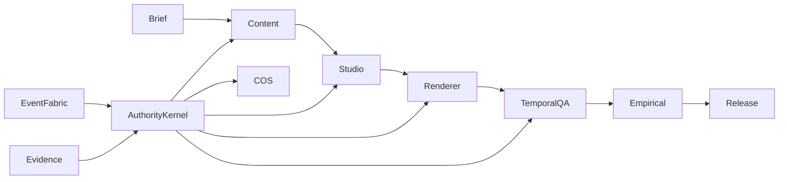

## 2. Dependency Graph

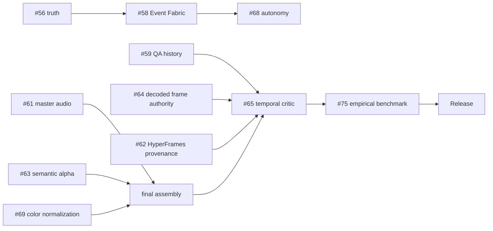

## 3. Execution Graph

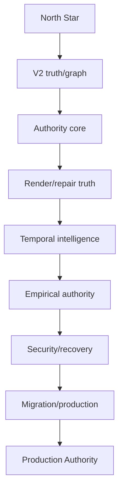

## 4. Agent Graph

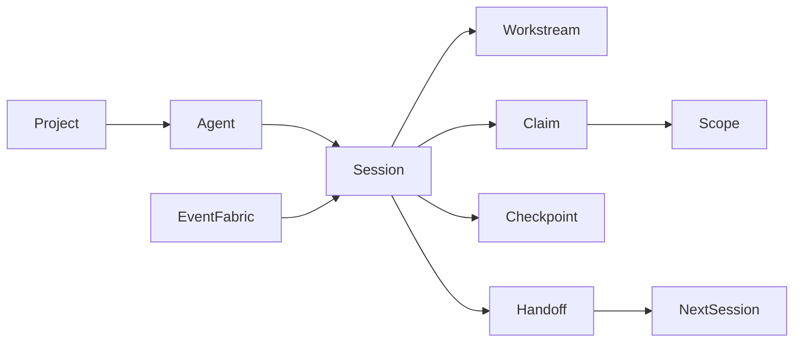

## 5. Session Graph

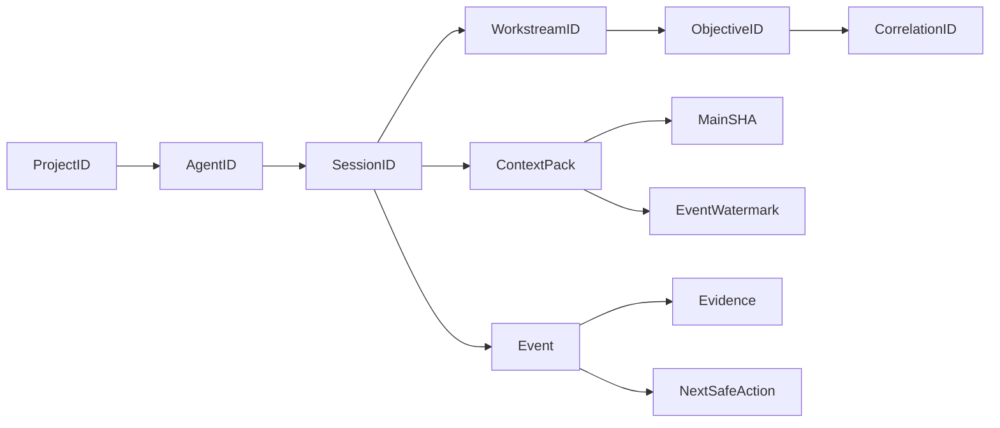

## 6. Knowledge Graph

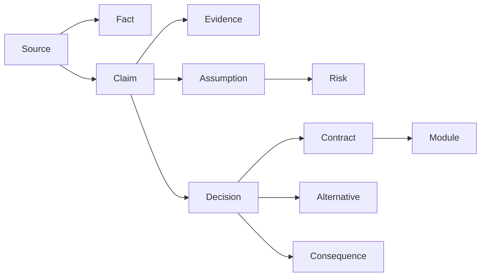

## 7. Decision Graph

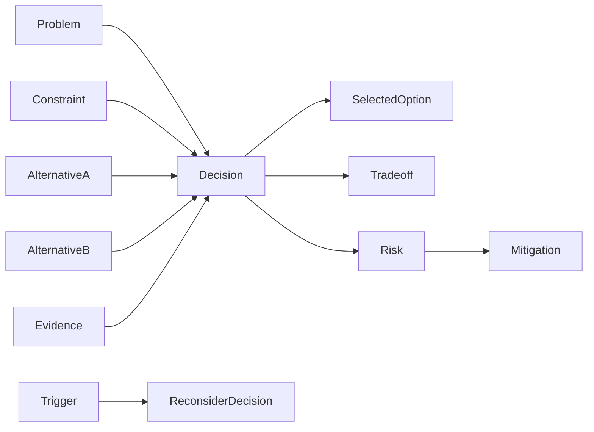

## 8. Risk Graph

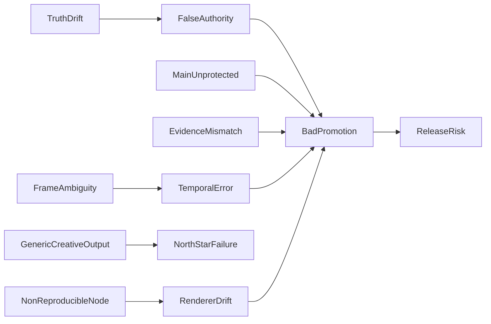

## 9. Test Graph

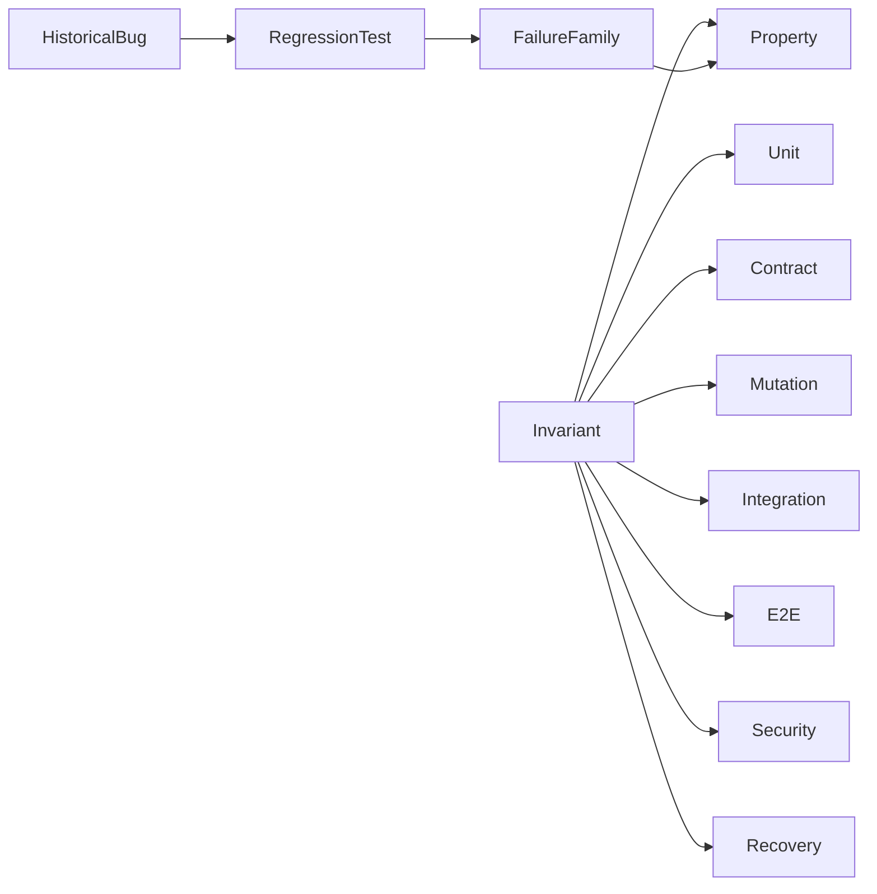

## 10. Evidence Graph

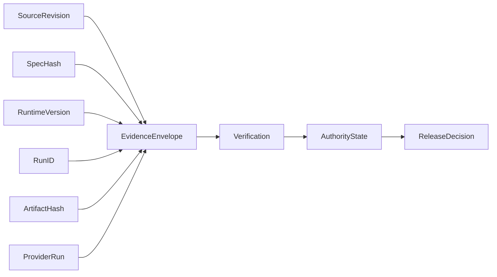

## 11. Artifact Graph

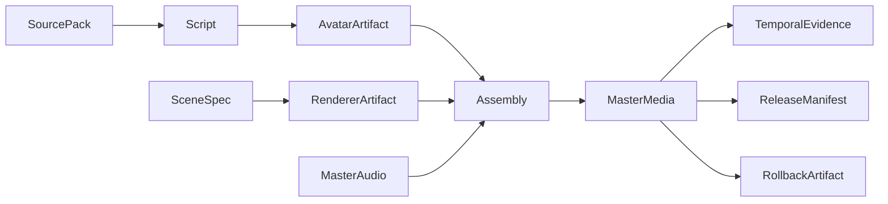

## 12. Workflow Graph

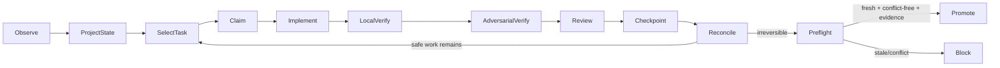

## 13. State Graph

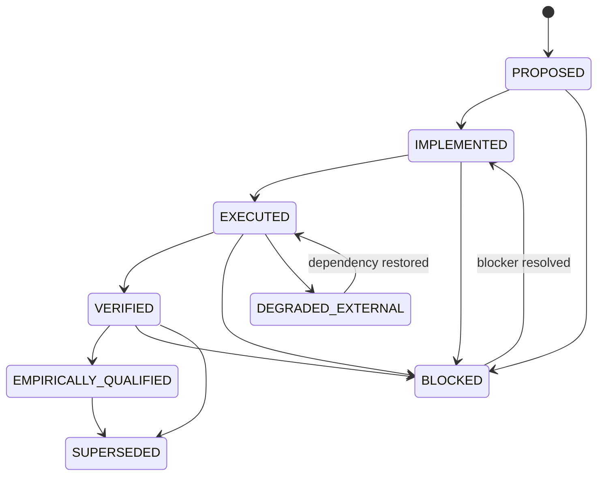

## 14. Recovery Graph

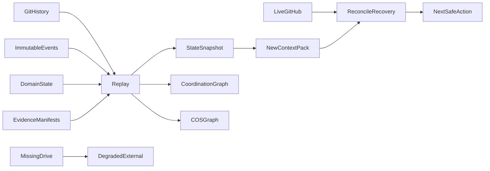

## 15. Security Graph

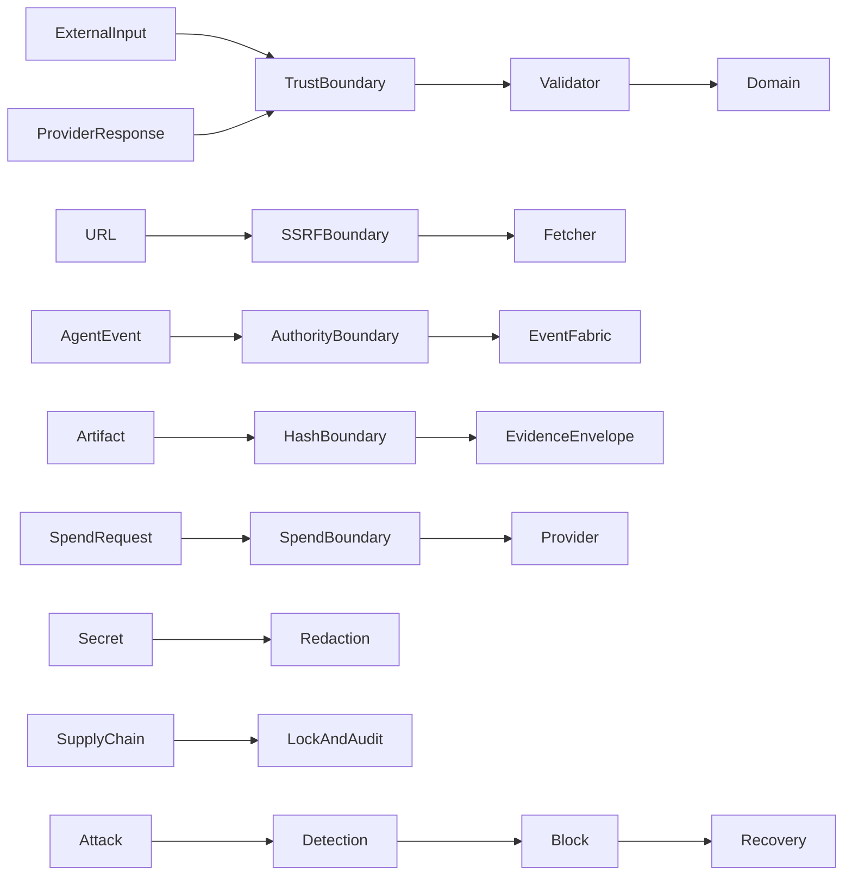

## 16. Architecture Graph

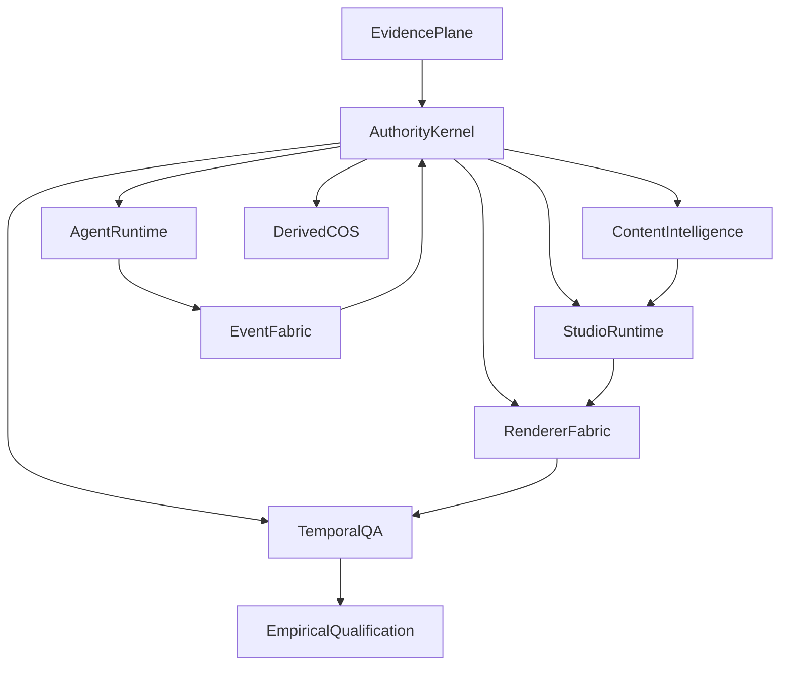

## 17. Historical Graph

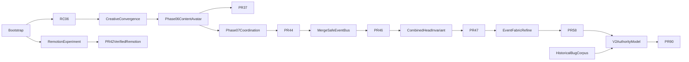

## 18. Roadmap Graph

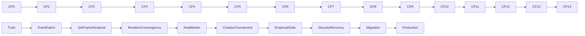

## 19. Product / Creative Quality Graph — domain L17

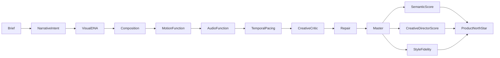

## 20. Empirical Learning Graph — domain L18

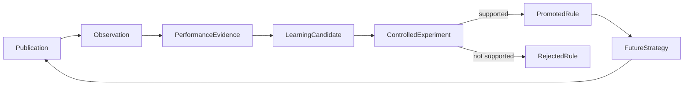

## 21. Release Authority Graph — domain L19

```mermaid
flowchart LR
  MainFresh --> Gate
  EventFresh --> Gate
  SecurityPass --> Gate
  RecoveryPass --> Gate
  RendererEvidence --> Gate
  TemporalEvidence --> Gate
  CreativeEvidence --> Gate
  EmpiricalEvidence --> Gate
  ProvenanceComplete --> Gate
  AdminGovernance --> Gate
  Gate -->|ALL| ProductionAuthority
  Gate -->|ANY missing| Blocked
```

## Projection law

Every projection is invalidated when any of its source revisions/watermarks change. Similarity, GraphRAG, dashboards and graph traversal may help discover relationships but cannot invent authority. A projection that cannot be deterministically rebuilt from its declared source set is a V2 defect.